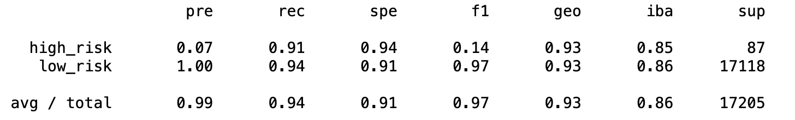

# Credit_Risk_Analysis

## Overview
The purpose of this analysis is to better understand which markers (variables) are the most significant in determining a lendee's eligibilty for a loan.

## Results

 Using bulleted lists, describe the balanced accuracy scores and the precision and recall scores of all six machine learning models. Use screenshots of your outputs to support your results.
 
 
- Our first model uses naive random sampling, and gives us results that show high predictive power for those who are low risk, but low power for those that are high-risk. This has the potential to open up our institution to loan defaults.

- Moving on to the model that uses the SMOTE oversampling methodology, we get a similar result, yet with even lower sensitivity.

- When undersampling, we can see that the sensitivty for low-risk lendees has decreased.

- Using a combination model allows for greater precision and accuracy than using either over- or under- sampling alone.

- The Balance Random Forest classifier gives us the greatest precision and accuracy yet.

- The easy ensemble methodolgy yields the strongest sensitivity by far, with greater than 90% in both low- and high-risk categories.
 

 
## Summary

Therefore, based on the above, it makes the most sense for us to implement the Easy Ensemble method in checking credit worthiness in loan applications. This model shows both the highest precision and sensitivity, allowing us to best understand the financial health of a given customer when evaluating their application for a loan.
